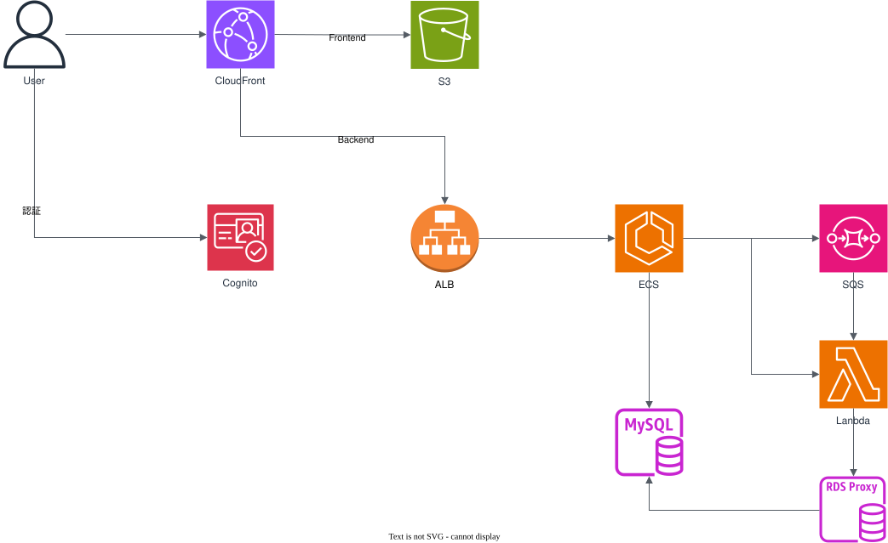

# UnreliableForge

**We forge reliable systems from unreliable worlds.**

学習用サンプルプロジェクト。

コーディングの練習ではなく、アーキテクト作成検証のためなので、本番向けを意識した構成とする。
アーキテクトの検証なので、AWS上でビルドからデプロイまでを行う。
STG環境までということで、BLUE, GREENデプロイとかやらない。
あとでやるかもしれないし、商用環境まではあまりやりたくないので、やらないかもしれない。

## やることリスト。アーキテクト

- AWSインフラ構成・認証方式の選定と設計
- API設計方針・共通レスポンスフォーマット策定
- Spring Boot ⇄ TypeScript 型自動生成スクリプトの検証

## やることリスト1

- frontendをデプロイ(S3へコピー)。まずは手動で。
- CloudFrontをセットアップ。frontendが見られるようにする。
- backendはDBがないと起動しないので、RDSを作る、IAM認証で。
- DB接続先を設定するための Parameter Storeを作る。
- backendをデプロイ。これもまずは手動で。
- ALBを作る。
- CloudFront:HTTPS -> ALB:backend8080 へ。
- ログインページを作る。まずは2ファクタ認証は行わない。
- Cognitoを設定する。
- 認証が必要なサンプルAPIを作成する。認可はあとで。
- AWS SSM ポートフォワードを使う(MySQL用)。

## やることリスト2

- Flywayでマイグレーション。
- Dockerでvitest(local)
- DockerでJUnitテスト(local)
- DockerでE2Eテスト(local)
- CloudFromationでVPC環境を作成する。
- CodeBuild, CodeDeploy, CodePipeline
- vitest を AWS で
- JUnit を AWS で
- E2EテストをAWSで
- テストレポートのの生成と公開(vitest)
- テストレポートのの生成と公開(JUnit)
- テストレポートのの生成と公開(E2E)

## AWSの構成

ALBがCognitoの認証を行い、トークンの管理を行う場合。

```
CloudFront
  + S3 (Reactで生成したページ。認可不要)
  + ALB -> Cognito  (ALBは認証をここで行う)
    + ECS　認可情報を参照し認可を行う。処理を行い、結果を返す。帳票などのファイルダウンロードは署名付きURLを返す。
      + Lambda ECSからLambdaを直接実行する（ECSに負荷をかけたくない場合に使用する）。
      + SQS
        + Lambda(時間がかかる処理を非同期で行う)　

MySQL
DynamoDB
```

Cognitoの認証を行い、トークンの管理は自分で行う場合。

```
CloudFront
  + S3 (Reactで生成したページ。認可不要)
    + Conginto認証ページ
      + AWS Conginto
  + ALB
    + ECS　
      + 認証セッションの管理
        + 認可情報を参照し認可を行う。処理を行い、結果を返す。帳票などのファイルダウンロードは署名付きURLを返す。
        + Lambda ECSからLambdaを直接実行する（ECSに負荷をかけたくない場合に使用する）。
        + SQS
          + Lambda(時間がかかる処理を非同期で行う)　

MySQL
DynamoDB(セッション管理用。とりあえずMySQLで行うので、まだ使わない)
```

簡単な構成図。
この図ではRedis(セッション管理と認可情報), SQSとLambdaがあるか、今回は使用しない。



## ALBとCongintoで認証を行う。

**この方法は使用しない。ALB＋Cognito 認証は SPA（React）と構造的に合わないため。**

1. ログイン状態を無効化できない（サーバー側で制御できない）
   ALB 認証は JWT の有効期限までログイン状態が続くため、
   バックエンド側から「ログアウト」や「セッション無効化」ができない。  
   認可変更の即時反映もできず、実務的な制御が困難。
2. 独自ログイン画面を使えない（Hosted UI 強制）
   ALB 認証は Cognito Hosted UI にリダイレクトされるため、
   自前のログイン画面を作れない。  
   SPA の UX やブランドデザインと根本的に合わない。
3. ログイン後に遷移しないケースに対応できない（SPA特有の要件）
   React アプリでは、 ログイン後に URL を変えず、状態だけ変えるケースが多い。
   しかし ALB 認証はリダイレクト前提であり、SPA の自然な UX と衝突する。
4. 独自セッション方式と比較して実装量が大きく減るわけではない。
   ALB 認証を使っても、
   JWT の署名検証、
   ユーザー情報の抽出、
   認可ロジック、
   ログアウト処理の代替
   など結局バックエンド側の実装が必要で、
   独自セッション方式と比べて大幅に楽になるわけではない。
5. 実際に使う情報は sub だけで、構造的メリットが小さい
   ALB が付与する x-amzn-oidc-data の JWT には多くの claim があるが、
   実務で使うのは ユーザー識別子（sub）だけ。
   DB上にユーザー情報として保持したほうが管理しやすく、claimを使うと二重管理になる。
   そのため、ALB 認証を使う構造的メリットがほぼない。

認証はCognitoを使う。バックエンドは認証済みのJWTのペイロード部分を受け取るだけとなる。
ECSで認可を行い、必要な処理を行う。あるいは、Lambdaを起動するか、SQSにキューを投げる。
ユーザーの区別には、Cognitoが発行するユニークな（sub）値を使用する。同じログインIDが使用されても、同じsubが発行されることはないので、別ユーザー扱いになる。
業務上はべつな値が割り振られるかもしれないが、システム上はsubを使用する。
このUIDから認可に必要な情報をテーブルなどから取得する。

バックエンドは ALB による認証プロセスを通る。このとき、ALBは以下のリクエストヘッダを付ける。

x-amzn-oidc-data（JWT のデコード済み JSON）
x-amzn-oidc-accesstoken
x-amzn-oidc-identity

Authorization リクエストヘッダは存在しない。

テスト時は、 Authorization ではなく、　x-amzn-oidc-data　をつける。これはJWTのペイロード部分をエンコードしたもの。
バックエンドの実装時は、 x-amzn-oidc-data　からペイロードを取得する。

## 認証をCognitoで行う。セッション情報を独自管理。

認証はCognitoを使用する。セッション情報は独自管理。WAFでセッション情報の管理を行わない。
ALB+Cognitoでの認証のデメリットをなくした方法。
多少実装が増える。
MFAに対応しようとすると、さらに実装が増える。
将来的に他の認証方法が増えた場合、それへの対応が必要。
といったデメリットが考えられるが、実装難易度、実装量から考えると、大きなデメリットとはならない。

1. ログインダイアログを作成する。

CongitoとAWSのライブラリを使用し、Cogintoでの認証を行う。
ブラウザでCognitoを使った認証を行う。受け取ったIDTokenはbackendで管理する。
ブラウザでトークンを保持しない。
アクセストークンとリフレッシュトークンは使用しない。

IDとパスワードを使用した簡単なログイン画面。
MFAやパスキーには対応していない。
受け取ったIDTokenはbackendを送信。

```
import { TextField, Button } from "@base-ui/react";

export function Login() {
  const [username, setUsername] = useState("");
  const [password, setPassword] = useState("");

  const handleLogin = async () => {
    const token = await login(username, password);
    // token をバックエンドへ送って HttpOnly Cookie に保存
  };

  return (
    <div className="flex flex-col gap-4 p-6 max-w-sm mx-auto">
      <TextField value={username} onChange={e => setUsername(e.target.value)} placeholder="Username" />
      <TextField type="password" value={password} onChange={e => setPassword(e.target.value)} placeholder="Password" />
      <Button onClick={handleLogin}>ログイン</Button>
    </div>
  );
}
```

```
import { CognitoIdentityProviderClient, InitiateAuthCommand } from "@aws-sdk/client-cognito-identity-provider";

const client = new CognitoIdentityProviderClient({ region: "ap-northeast-1" });

async function login(username: string, password: string) {
  const command = new InitiateAuthCommand({
    AuthFlow: "USER_PASSWORD_AUTH",
    ClientId: "<YOUR_APP_CLIENT_ID>",
    AuthParameters: {
      USERNAME: username,
      PASSWORD: password,
    },
  });

  const res = await client.send(command);
  return res.AuthenticationResult?.IdToken;
}
```

受け取ったIDをサーバー側へ送る。

```
await fetch("/api/session", {
  method: "POST",
  body: JSON.stringify({ idToken }),
  headers: { "Content-Type": "application/json" },
});
```

サーバー側は、受け取ったIDを検証する。
JWTによる検証を行い、検証の成功でセッションIDを生成し、DBにsubとともに保存する（IDTokenではないことに注意）。
このコードは iss, aud の検証を行っていないため、セキュリティ上の問題があります。

```
@RestController
public class SessionController {

    private final JwtDecoder jwtDecoder;

    public SessionController() {
        String jwkSetUri = "https://cognito-idp.ap-northeast-1.amazonaws.com/<USER_POOL_ID>/.well-known/jwks.json";
        this.jwtDecoder = NimbusJwtDecoder.withJwkSetUri(jwkSetUri).build();
    }

    @PostMapping("/api/session")
    public ResponseEntity<?> createSession(@RequestBody Map<String, String> body) {
        String idToken = body.get("idToken");

        // JWT 検証
        Jwt jwt = jwtDecoder.decode(idToken);

        // ユーザー名取得
        String username = jwt.getClaimAsString("cognito:username");

        // HttpOnly Cookie をセット
        ResponseCookie cookie = ResponseCookie.from("session", idToken)
                .httpOnly(true)
                .secure(true)
                .sameSite("Strict")
                .path("/")
                .maxAge(3600)
                .build();

        return ResponseEntity.ok()
                .header(HttpHeaders.SET_COOKIE, cookie.toString())
                .body(Map.of("username", username));
    }
}
```

iss, sudも検証するようにしたもの。AIが生成したものなので、これあ本当に正しいものかを調べること。

```
public SessionController() {
    String userPoolId = "<USER_POOL_ID>";
    String clientId = "<APP_CLIENT_ID>"; // パラメータストア等から取得
    String region = "ap-northeast-1";

    String issuer = String.format("https://cognito-idp.%s.amazonaws.com/%s", region, userPoolId);
    String jwkSetUri = issuer + "/.well-known/jwks.json";

    // 1. 基本的なデコーダーを作成
    NimbusJwtDecoder jwtDecoder = NimbusJwtDecoder.withJwkSetUri(jwkSetUri).build();

    // 2. iss と aud (CognitoのApp Client ID) をチェックするバリデータを作成
    OAuth2TokenValidator<Jwt> issuerValidator = JwtValidators.createDefaultWithIssuer(issuer);
    OAuth2TokenValidator<Jwt> audienceValidator = new JwtClaimValidator<List<String>>(
            JwtClaimNames.AUD,
            aud -> aud != null && aud.contains(clientId)
    );

    // 3. バリデータ群を合成してデコーダーに設定
    OAuth2TokenValidator<Jwt> combinedValidator =
            new DelegatingOAuth2TokenValidator<>(issuerValidator, audienceValidator);

    jwtDecoder.setJwtValidator(combinedValidator);

    this.jwtDecoder = jwtDecoder;
}
```

APIは、CookieからセッションIDを取得する。取得できなければ未認証エラー。
DBにセッションIDが存在しない場合、未認証エラー。

### ローカル開発環境の構成。

docker compose を使用する。
認証（のトークン管理）方式を変更したため、~~nginxは backend へのリダイレクト時に ダミーの x-amzn-oidc-data を付与する~~は行わない。

```
WSL
  + nginx
    + frontend(/ を host.docker.internal:5173へリダイレクト)
    + backend(/api を backend:8080 へリダイレクト)
  db
```

ローカル動作確認環境の構成

```
WSL
  + nginx(frontend/distをホスト)
    + backend(/api を backend:8080 へリダイレクト)
  db
```

## WSL環境の設定

WSL2でUbuntuを使えるようにしましょう。

wsl --installl Ubuntu

### localeの設定

language packをインストール。localeを変更。

```
sudo apt update
sudo apt install language-pack-ja locales
sudo update-locale LANG=ja_JP.UTF-8

$ locale
LANG=ja_JP.UTF-8
LANGUAGE=
LC_CTYPE="ja_JP.UTF-8"
LC_NUMERIC="ja_JP.UTF-8"
LC_TIME="ja_JP.UTF-8"
LC_COLLATE="ja_JP.UTF-8"
LC_MONETARY="ja_JP.UTF-8"
LC_MESSAGES="ja_JP.UTF-8"
LC_PAPER="ja_JP.UTF-8"
LC_NAME="ja_JP.UTF-8"
LC_ADDRESS="ja_JP.UTF-8"
LC_TELEPHONE="ja_JP.UTF-8"
LC_MEASUREMENT="ja_JP.UTF-8"
LC_IDENTIFICATION="ja_JP.UTF-8"
LC_ALL=
```

ついでにタイムゾーンも。
いつのまにか Asia/Tokyoになっていたけど、一応確認しよう。

```
sudo timedatectl set-timezone Asia/Tokyo
```

### 必要なアプリのインストール

- Docker(Windows上にDockerDesktopをインストール)
- npm, node

```
$ curl -o- https://raw.githubusercontent.com/nvm-sh/nvm/v0.40.6/install.sh | bash
$ export NVM_DIR="$HOME/.nvm"
$ [ -s "$NVM_DIR/nvm.sh" ] && \. "$NVM_DIR/nvm.sh"
$ nvm --version
$ nvm install --lts
$ node --version
$ npm --version
```

- Visual Studio Code(Windowにインストール)
- Amazon Corretto 25
- その他お好みで

## APIのパス、メソッド、戻り値

メソッドはPOSTのみ使用する。
URLはリソースのロケーションを表すためにあるものだが、APIはリソースのロケーションではない。
そのため、URLはローケーションではなく、実行するAPIのクラス名、メソッド名といったイメージになる。
そのような形でHTTPを使用した場合、HTTPのルールを厳密に守る必要はなくなる。リソースの位置を表すものを、むりやりAPIとしているため、HTTPのルールを厳密に守ると無理がでできて、無駄に複雑になる。

パスパラメータと?以降のパラメータは使用しない。パラメータはすべてリクエストボディのJSON形式で渡す。

POSTではCDNのキャッシュがきかないらしい。
APIなので、キャッシュがなくても問題ない。というか、キャッシュされないほうがいい。

戻り値もすべてJSON形式とする。

HTTPの上にできるだけシンプルな形でRCP（のようなもの）を載せたような感じになっているので、そういう意味ではあまり美しいものではないと思う。
けど、使えるものはこれしかないので、しかたがない。
そのうち、このような意図を持ったプロトコルが実装されることでしょう。
SOAP?あんなものは忘れてしまいましょう。

## APIのパスと型。

SpringBootでAPIを定義した場合、当然だけど、SpringBoot内ではその型定義を使用することができる。
その型情報をfrontend(TypeScript)で使うことができたらいいのでは？

SpringBootのAPIから、自動的にOpenAPIの定義書を作成することができる。
この方法だと、frontend側ではSpringBootで定義したAPIの型情報を使うことができない。
OpenAPIの定義書では、型チェックが機能しないので、わかりにくいし、エラーの原因となりうる。
JavaScriptを使っているならともかく、せっかくTypeScriptを使っているのだから、SpringBootのメソッドの型情報をTypeScriptで使えるようにしたい。また、その型情報は自動的に生成するようにしたい。

TSでのレスポンスの定義例。ジェネリクスで合成する。Javaでもだいたい同じ。

```

export type ApiBaseResponse = {
severity: "success" | "info" | "warning" | "error" | "invalidate";
message: string;
invalid?: Record<string, string>; // JSON path → メッセージ
};

```

```

export type ApiResponse<T> = ApiBaseResponse & {
data: T;
};

```

### こんな感じでできたらいいな

構想なので、具体的な方法はこれから。
やりたいことは、大まかにいうとこんな感じ。

1. @Mappingを使わずに、Controllerから@Mappingを自動生成。
2. Controllerのパラメータ、戻り値のBeanからTypeScript側で使用する型定義を自動的に生成。

APIは SpringBootの controller/** 以下に、 *Controller というクラス名で作成する。
*Controllerのクラスには @RequestMapping("/api") をつけない。
*Controllerクラスにあるメソッドには @GetMapping("/api/v1")　のようなマッピング定義を行わない。
パッケージ名とクラス名から自動的に適切なパスとなるように設定する（アノテーションをつけたほうが楽かもしれないが、パスはクラス名/メソッド名という扱いなので、決まったルールで機械的につけてしまいたい）。

パラメータの型をBeanで定義する。@NonNullなどを使用する。戻り値の型も同様。
このBeanクラスから、frontendで使用するAPI型定義ファイルを自動生成する。

自動生成した型定義はこんな感じ。

```

export type ApiMap = {
// APIのパス。Controllerからいい感じに自動生成する。
"v1/hello": {
// v1/hello のパラメータと戻り値の型を定義し、それを指定する。
// この型定義は、メソッドのパラメータと戻り値の型から自動的に生成する。
// ? とか | null もあるので、全自動とはならないかもしれない。
// Bean定義に
// @NotNull → TS では string
// @Nullable → TS では string | null
// Optional<T> → TS では T | null
//とすることである程度自動化できる。TS側はnullは使用せずにundefinedで統一。
input: any | undefined; // まだAPIがないので、anyとしている。実際にはanyは使用しない。
output: any;
};
};

```

さすがにControllerに @Mapping をつけないというのはやりすぎかもしれないが、自動的にパスマッピングを行うというはやりたい。

## テスト

### frontend単体テスト

#### ローカル

vitestを使う。詳しくはソースを参照。
テストレポートは生成しない。
必要なら作成してもいいし、nginxで見られるようにしておくのもいいかもしれない）。
gitにもあげない。

#### AWSで行う

ローカルで行っていたことをCodeBuidで行うだけ。ビルドしてvitestを実行するだけなので、たぶん簡単にできる。
テストレポートを生成する。CodeBuildでS3にアップロードする。

アップロード先の例。最新の <DATETIME> と latest は同じものをアップロードする。

S3/\<ENV>/frontend/\<DATETIME>/report

テストレポート -> S3/\<ENV>/frontend/\<DATETIME>/report
ビルド生成物 -> S3/\<ENV>/frontend/\<DATETIME>/dist
テストレポート(最新) -> S3/\<ENV>/frontend/latest/report
ビルド生成物(最新) -> S3/\<ENV>/frontend/latest/dist
CloudFront公開 -> ビルド生成物(最新)と同じ

ローカルで作成したテストレポート（HTMLで作成）は、nginxで見られるようにするのはいい考えかもしれない。
テストレポートをちょっと見せるだけなのに、いちいちファイルコピーとかやってられないでしょ。
開発用のnginxにこの設定を書いておくのはいい考えかもしれない。
nginxでfrontendをマウントして公開ディレクトリをnginx.confで指定するだけだから、まったく負担にならない。
http://<ホスト名>:<ポート番号> で見られるようにしておくだけ。

### backend単体テスト

#### ローカルで行う

IDtoken形式の認証情報が必要。local環境ではIDTokenの検証を行わないので、適当なIDTokenっぽいものを /aws/session に渡せばよい。
DB上のユーザー情報に同じsubのレコードを作成しておくこと。

#### AWS で行う

### E2Eテスト

#### ローカルで行う

Docker composeで一発実行。ただし、frontendは事前のビルドが必要。
レポートとかまだ考えてないけど、そのうちやります。

### AWSで行う

CodeBuildでも同じことを行う。
Dockerでできているので、CodeBuild上でやるのも難しくないでしょう。

```

```
